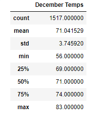
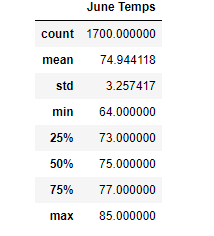

# surfs_up

## Purpose 
The purpose of this analysis was to compare the temperature trends in order to determine if a surf and ice cream shop would be profitable. By using SQLAlchemy, Python and Pandas, the summary statistics for December and June will be obtained.

## Results
* The minimum temperature in December is 56
* The average temperature in December is 71
* The average temperature in June is 74

## Summary
With the average temps varying by 3 degrees between June and December, the weather in Oahu is optimal for a surf and ice cream shop. The temperature does reach a low of 56 degrees however, with the usual temps being in the 70s, the shop will be sustainable year-round. In addition to running an analysis on the weather, the difference in precipitation and wind could also be extracted to determine the business proposal even further. 
